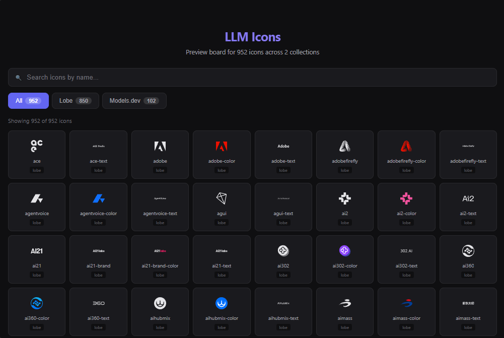
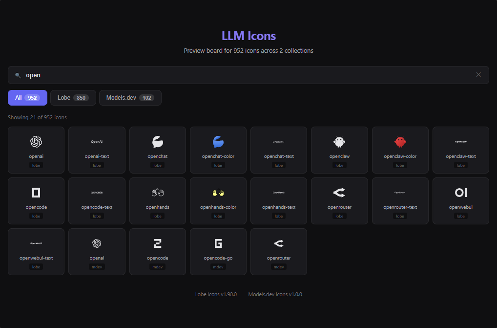

**中文** | [English](README.md)

# LLM Icons

精选的 AI/LLM 模型品牌图标集合，以 [Iconify](https://iconify.design/) JSON 格式打包，实现通用兼容。

<p align="center">
  
  &nbsp;&nbsp;
  
</p>

## 图标集 [  [Lobe Icons](https://icons.lobehub.com/), [Models.dev](https://models.dev/) ]

| 包名 | 前缀 | 图标数 | 来源 |
|------|------|--------|------|
| [`llmicons`](./package.json)（根包） | `lobe` / `mdev` | 950+ | 合集 |
| [`@llmicons-json/lobe`](./icons/lobe) | `lobe` | 850+ | [lobe-icons](https://github.com/lobehub/lobe-icons) |
| [`@llmicons-json/mdev`](./icons/mdev) | `mdev` | 100+ | [models.dev](https://github.com/anomalyco/models.dev) |

## 安装

根据项目需求选择安装方式：

### 方式 A：全部（多集合）

```bash
pnpm add llmicons
# 或
npm install llmicons
```

通过子路径导出导入：

```ts
import lobeIcons from 'llmicons/lobe/icons.json';
import mdevIcons from 'llmicons/mdev/icons.json';
```

### 方式 B：独立包（单集合）

```bash
pnpm add @llmicons-json/lobe
# 或
pnpm add @llmicons-json/mdev
```

```ts
import lobeIcons from '@llmicons-json/lobe/icons.json';
```

## 使用方式

### 配合 `@iconify/react`（React 推荐）

```tsx
import { Icon, addCollection } from '@iconify/react';
import lobeIcons from 'llmicons/lobe/icons.json';
// import { icons as lobeIcons } from 'llmicons/lobe';

// 注册图标集（只需一次）
addCollection(lobeIcons);

function App() {
  return (
    <div>
      {/* 使用 前缀:图标名 语法 */}
      <Icon icon="lobe:openai" width={24} />
      <Icon icon="lobe:deepseek" width={24} />
      <Icon icon="mdev:anthropic" width={24} />
    </div>
  );
}
```

### 配合 `@iconify/vue` / `@iconify/svelte` / `@iconify/web`

`addCollection` + `Icon` 模式在所有框架中通用：

```vue
<script setup>
import { Icon, addCollection } from '@iconify/vue';
import lobeIcons from '@llmicons-json/lobe/icons.json';
// import { icons as lobeIcons } from '@llmicons-json/lobe';

addCollection(lobeIcons);
</script>

<template>
  <Icon icon="lobe:openai" :width="24" />
</template>
```

### 配合 UnoCSS

安装 UnoCSS 及图标预设：

```bash
pnpm add -D unocss @unocss/preset-icons
```

在 `uno.config.ts` 中注册图标集：

```ts
import { defineConfig, presetIcons } from 'unocss';
import { icons as lobeIcons } from 'llmicons/lobe';
// import lobeIcons from 'llmicons/lobe/icons.json';

export default defineConfig({
  presets: [
    presetIcons({
      collections: {
        lobe: () => lobeIcons,
      },
    }),
  ],
});
```

在模板中使用：

```html
<!-- 前缀:图标名 -->
<span class="i-lobe:openai text-2xl" />
<span class="i-lobe:deepseek text-2xl text-blue-500" />
<span class="i-mdev:anthropic text-2xl" />
```

### 配合 Vite + `unplugin-icons`

```bash
pnpm add -D unplugin-icons
```

```ts
// vite.config.ts
import { defineConfig } from 'vite';
import Icons from 'unplugin-icons/vite';
import { ExternalPackageIconLoader } from 'unplugin-icons/loaders';

export default defineConfig({
  plugins: [
    Icons({
      customCollections: {
        ...ExternalPackageIconLoader('@llmicons-json/lobe'),
        ...ExternalPackageIconLoader('@llmicons-json/mdev'),
      },
    }),
  ],
});
```

在组件中自动导入图标：

```tsx
// 由 unplugin-icons 自动导入
import IconLobeOpenai from '~icons/lobe/openai';
import IconMdevAnthropic from '~icons/mdev/anthropic';

function App() {
  return (
    <div>
      <IconLobeOpenai style={{ fontSize: '24px' }} />
      <IconMdevAnthropic style={{ fontSize: '24px', color: '#6366f1' }} />
    </div>
  );
}
```

### 直接导入 JSON（框架无关）

```ts
import lobeIcons from 'llmicons/lobe/icons.json';
// import { icons as lobeIcons } from 'llmicons/lobe';

// lobeIcons 是 IconifyJSON 对象
console.log(lobeIcons.icons['openai']); // SVG body
console.log(lobeIcons.icons['openai'].body); // 原始 SVG 路径数据

// 渲染内联 SVG
function renderIcon(name: string): string {
  const icon = lobeIcons.icons[name];
  if (!icon) return '';
  return `<svg viewBox="0 0 24 24" width="24" height="24">${icon.body}</svg>`;
}
```

## 构建

### 初始化

```bash
git clone https://github.com/fn-a/llmicons
cd llmicons
pnpm install
git submodule update --init --recursive
pnpm run build
```

### 命令

| 命令 | 说明 |
|------|------|
| `pnpm run build` | 构建所有图标集 |
| `pnpm run build:lobe` | 仅构建 lobe 集 |
| `pnpm run build:mdev` | 仅构建 mdev 集 |
| `pnpm run pullup` | 拉取最新子模块 |
| `pnpm run chain` | 拉取子模块后构建全部 |
| `pnpm run board` | 启动本地服务器预览图标 |

## 许可证

MIT